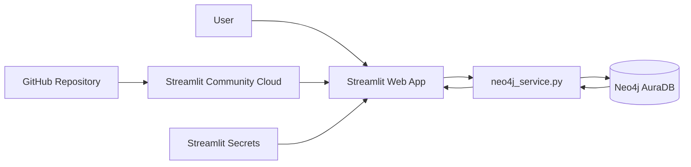
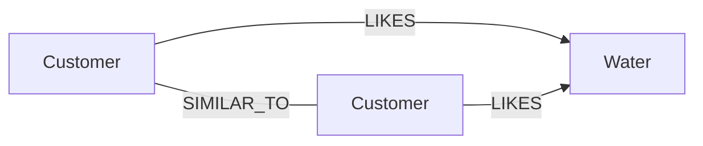

# คู่มือสร้างระบบแนะนำน้ำแร่ด้วย Neo4j Aura + Streamlit

## 1) เป้าหมายการเรียนรู้

เมื่อทำโปรเจ็คนี้เสร็จ นักศึกษาควรสามารถ

1. ออกแบบ Property Graph จากโจทย์ระบบจริง
2. อธิบาย Node, Label, Property, Relationship และ Direction
3. เขียน Cypher สำหรับ CRUD, traversal และ aggregation
4. เชื่อม Python กับ Neo4j Aura ด้วย official Neo4j Python Driver
5. สร้าง Explainable Recommendation จากความสัมพันธ์ในกราฟ
6. พัฒนา Web UI ด้วย Streamlit
7. แยก secret/credential ออกจาก source code
8. deploy ระบบจาก GitHub ไป Streamlit Community Cloud

---

## 2) สถาปัตยกรรมระบบ



แยกเป็น 4 ชั้น

- **Presentation layer:** `app.py`
- **Database access layer:** `neo4j_service.py`
- **Graph database:** Neo4j AuraDB
- **Deployment/configuration:** GitHub + Streamlit Community Cloud + Secrets

---

## 3) Graph Data Model



### Node

| Label | Primary property | ตัวอย่าง property | หน้าที่ |
| --- | --- | --- | --- |
| Customer | customer_id | name | ลูกค้า / ผู้ใช้ระบบ |
| Water | water_id | name, image | น้ำแร่ |

> `image` คือรูปที่ผู้ใช้อัปโหลด (ไม่บังคับ) เก็บเป็น byte array ใน node `Water` โดย `app.py` ย่อเป็น JPEG ไม่เกิน 480 px ก่อนบันทึก
> เหตุผลที่เก็บในฐานข้อมูลแทนไฟล์ คือ Streamlit Community Cloud ไม่เก็บไฟล์ที่อัปโหลดไว้ถาวร
> น้ำแร่ที่ยังไม่ได้อัปโหลดรูปจะใช้รูปประจำแบรนด์ในโฟลเดอร์ `images/` ที่ชื่อไฟล์ตรงกับชื่อน้ำแร่ ถ้าไม่มีจะแสดงรูปขวดที่ระบบวาดให้

### Relationship

| Relationship | Source → Target | Property | ความหมาย |
| --- | --- | --- | --- |
| SIMILAR_TO | Customer — Customer | - | ลูกค้าที่มีรสนิยมการเลือกน้ำแร่คล้ายกัน |
| LIKES | Customer → Water | - | ลูกค้าชอบน้ำแร่ |

> `SIMILAR_TO` ถูกสร้างเพียงหนึ่ง relationship ต่อคู่ และ query แบบ `-[:SIMILAR_TO]-` เพราะความหมายของงานมองว่าความคล้ายกันเป็นแบบสมมาตร
> Neo4j เก็บ relationship แบบมีทิศทางเสมอ แต่เราเลือก “ไม่สนทิศทาง” ได้ตอน query

---

## 4) เหตุผลที่ Graph Database เหมาะกับโจทย์นี้

ใน RDBMS การหา “น้ำแร่ที่ลูกค้าที่คล้ายกันชอบ แต่เจ้าตัวยังไม่ได้ชอบ” ต้อง JOIN หลายตาราง เช่น Customer, Similarity, Likes และ Water

ใน Graph สามารถเขียนเป็น pattern ได้ใกล้เคียงกับโจทย์โดยตรง

```cypher
MATCH (me:Customer {customer_id:$customer_id})
      -[:SIMILAR_TO]-(similar:Customer)
      -[:LIKES]->(water:Water)
WHERE NOT EXISTS { MATCH (me)-[:LIKES]->(water) }
RETURN water
```

จุดสำคัญคือเรา query **ความสัมพันธ์และเส้นทาง** ไม่ได้มองเฉพาะ record แยกตาราง

---

## 5) Recommendation Algorithm

ระบบใช้ Collaborative Filtering แบบง่ายบนกราฟ

1. เริ่มจากลูกค้าเป้าหมาย (`me`)
2. เดินไปยังลูกค้าที่คล้ายกันผ่าน `SIMILAR_TO`
3. เดินต่อไปยังน้ำแร่ที่ลูกค้าเหล่านั้น `LIKES`
4. ตัดน้ำแร่ที่ `me` ชอบอยู่แล้วออก
5. นับจำนวนลูกค้าที่คล้ายกันซึ่งชอบน้ำแร่แต่ละแบรนด์เป็นคะแนน

```text
score = count(DISTINCT similar)
```

น้ำแร่ที่มีลูกค้าที่คล้ายกันชอบหลายคนจึงได้คะแนนสูงกว่า

```cypher
MATCH (me:Customer {customer_id:$customer_id})
      -[:SIMILAR_TO]-(similar:Customer)
      -[:LIKES]->(water:Water)
WHERE NOT EXISTS { MATCH (me)-[:LIKES]->(water) }
WITH DISTINCT water, similar
ORDER BY similar.customer_id
RETURN water.water_id AS water_id,
       water.name AS recommendation,
       count(similar) AS score,
       collect(similar.name) AS similar_names
ORDER BY score DESC, recommendation
LIMIT $limit
```

สูตรนี้มีเป้าหมายเพื่อสอนแนวคิด recommendation และ graph traversal ไม่ได้อ้างว่าเป็นสูตรที่เหมาะที่สุดในเชิงวิจัย

---

## 6) Explainable Recommendation

ระบบไม่ได้คืนเพียงชื่อน้ำแร่และ score แต่คืน evidence ด้วย คือ **ชื่อลูกค้าที่คล้ายกันซึ่งชอบน้ำแร่นั้น**

ตัวอย่างคำอธิบายบน UI สำหรับ Somsak (C009)

```text
#1 · score 2   Singha
เหตุผล: ลูกค้าที่คล้ายกัน 2 คนชอบ (Nattapong, Malee)
```

นี่เป็นข้อดีเชิงการเรียนรู้ เพราะนักศึกษาสามารถ trace กลับไปยัง graph pattern ที่ทำให้เกิดคำแนะนำได้

---

## 7) Constraint และเหตุผลที่ต้องใช้ MERGE

สร้าง key ของ node ให้ unique

```cypher
CREATE CONSTRAINT customer_id_unique IF NOT EXISTS
FOR (u:Customer) REQUIRE u.customer_id IS UNIQUE;

CREATE CONSTRAINT water_id_unique IF NOT EXISTS
FOR (w:Water) REQUIRE w.water_id IS UNIQUE;
```

การ seed ตัวอย่างใช้ `MERGE`

```cypher
MERGE (u:Customer {customer_id: row.customer_id})
SET u.name = row.name
```

ข้อดีคือใช้ `customer_id` เป็นตัวระบุ node เดิมก่อนสร้างใหม่ ทำให้ script ตัวอย่างสามารถรันซ้ำได้โดยไม่เพิ่ม Customer เดิมเป็นหลาย node

---

## 8) CRUD ด้วย Cypher

### Create — เพิ่มลูกค้าโดยไม่ให้รหัสซ้ำ

```cypher
OPTIONAL MATCH (x:Customer {customer_id:$customer_id})
WITH x WHERE x IS NULL
CREATE (u:Customer {customer_id:$customer_id, name:$name})
RETURN u.customer_id AS customer_id
```

ถ้ารหัสถูกใช้แล้ว query จะไม่คืนแถวใด ๆ และ UI จะแจ้งว่ารหัสซ้ำ

### Update — แก้ไขชื่อ

```cypher
MATCH (u:Customer {customer_id:$customer_id})
SET u.name = $name
```

### Delete — ลบ node พร้อม relationship

```cypher
MATCH (u:Customer {customer_id:$customer_id})
DETACH DELETE u
```

`DELETE` ธรรมดาจะ error ถ้า node ยังมี relationship อยู่ จึงต้องใช้ `DETACH DELETE`

### Relationship — เพิ่มและลบ

```cypher
// เพิ่ม LIKES
MATCH (u:Customer {customer_id:$customer_id})
UNWIND $water_ids AS water_id
MATCH (w:Water {water_id: water_id})
MERGE (u)-[:LIKES]->(w)

// ลบ LIKES ที่ไม่ได้เลือกแล้ว
MATCH (u:Customer {customer_id:$customer_id})-[r:LIKES]->(w:Water)
WHERE NOT w.water_id IN $water_ids
DELETE r
```

สำหรับ `SIMILAR_TO` ใช้ `MERGE (a)-[:SIMILAR_TO]-(b)` แบบไม่ระบุทิศทาง เพื่อไม่ให้เกิด relationship ซ้ำสองเส้นในคู่เดียวกัน

---

## 9) Parameterized Cypher

ไม่ควรเขียน

```python
cypher = "MATCH (u:Customer {customer_id:'" + customer_id + "'}) RETURN u"
```

ควรเขียน

```python
cypher = "MATCH (u:Customer {customer_id:$customer_id}) RETURN u"
params = {"customer_id": customer_id}
```

แล้วส่ง parameter ผ่าน Neo4j Driver ซึ่งทำให้โค้ดอ่านง่ายและหลีกเลี่ยงการนำ input ไปประกอบ query string โดยตรง
ประเด็นนี้สำคัญขึ้นเมื่อระบบเปิดให้ผู้ใช้พิมพ์รหัสและชื่อเองในหน้า Customers / Waters

---

## 10) การเชื่อมต่อ Neo4j Aura

`neo4j_service.py` สร้าง `Driver` เพียงหนึ่งตัวและ cache ด้วย `@st.cache_resource`

```python
@st.cache_resource(show_spinner=False)
def get_driver():
    driver = GraphDatabase.driver(uri, auth=(username, password))
    driver.verify_connectivity()
    return driver
```

จากนั้น query ด้วย `driver.execute_query()` พร้อมระบุ database และ parameter

```python
records, _, _ = driver.execute_query(
    cypher,
    parameters_=parameters,
    database_=database,
)
```

ชื่อ database ของ Aura instance หาได้จาก `SHOW HOME DATABASE` (ใน notebook คือ `5224144b`)

---

## 11) หน้าจอของระบบ

### Dashboard

- จำนวน Customer, Water, LIKES และ SIMILAR_TO
- ตารางความนิยมของน้ำแร่
- โปรไฟล์ลูกค้า: น้ำแร่ที่ชอบและลูกค้าที่คล้ายกัน

### Recommendations

- เลือก Customer
- กำหนด Top-N
- แสดง score
- แสดงเหตุผลประกอบคำแนะนำ

### Customers / Waters

- ตารางข้อมูลทั้งหมด
- เพิ่ม (ระบบเสนอรหัสถัดไปให้ และตรวจรหัสซ้ำ)
- แก้ไขชื่อ
- ลบ (ต้องติ๊กยืนยัน และลบ relationship ที่เกี่ยวข้องด้วย)
- เฉพาะ Waters: แกลเลอรีรูป, อัปโหลดรูปตอนเพิ่ม, เปลี่ยนหรือลบรูปตอนแก้ไข (png / jpg / webp)

### Relationships

- เลือก Customer
- เพิ่ม / เอาออกน้ำแร่ที่ชอบ (`LIKES`)
- เพิ่ม / เอาออกลูกค้าที่คล้ายกัน (`SIMILAR_TO`)
- ตาราง relationship ทั้งหมดในระบบ

### Graph Explorer

- แสดง neighborhood graph ของ Customer
- ใช้ relationship จริงจาก Aura
- เปิดดู edge table ได้

### Admin / Setup

- สร้าง constraints
- seed sample nodes/relationships
- ใช้ `MERGE` เพื่อรองรับการรันซ้ำ

---

## 12) Secrets

สร้าง local file

```text
.streamlit/secrets.toml
```

เนื้อหา

```toml
[neo4j]
uri = "neo4j+s://YOUR_INSTANCE.databases.neo4j.io"
username = "YOUR_USERNAME"
password = "YOUR_PASSWORD"
database = "YOUR_DATABASE"
```

ห้าม commit ไฟล์นี้ขึ้น GitHub โดย `.gitignore` ของโปรเจ็คเตรียมไว้แล้ว

---

## 13) GitHub

ตัวอย่างคำสั่ง

```bash
git init
git add .
git commit -m "Initial mineral water recommender"
git branch -M main
git remote add origin YOUR_GITHUB_REPOSITORY_URL
git push -u origin main
```

ก่อน push ตรวจอีกครั้งว่า `.streamlit/secrets.toml` ไม่อยู่ใน staged files

```bash
git status
```

---

## 14) Deploy Streamlit Community Cloud

1. เปิด Streamlit Community Cloud
2. Create app
3. เลือก GitHub repository
4. branch = `main`
5. main file = `app.py`
6. Advanced settings → Secrets
7. paste ค่า `[neo4j] ...`
8. Deploy

เมื่อ app เริ่มทำงานจะติดตั้ง package ตาม `requirements.txt`

---

## 15) ลำดับ Lab ที่แนะนำ

### Lab 1 — Graph Model

ให้นักศึกษาวาด Node/Relationship ก่อนเขียนโปรแกรม

### Lab 2 — Seed Data

สร้าง constraint และใช้ `UNWIND + MERGE`

### Lab 3 — Basic Cypher

`MATCH`, `WHERE`, `RETURN`, `ORDER BY`

### Lab 4 — Traversal

หา Water ผ่าน Customer ที่คล้ายกัน

### Lab 5 — Aggregation

ใช้ `count(DISTINCT similar)` และ `collect()`

### Lab 6 — Recommendation

ตัดน้ำแร่ที่ชอบอยู่แล้วออก และจัดอันดับด้วย score

### Lab 7 — Python Driver

เรียก Cypher จาก Python แบบ parameterized

### Lab 8 — Streamlit + CRUD

สร้าง UI สำหรับเพิ่ม / แก้ไข / ลบ node และ relationship

### Lab 9 — Deployment

GitHub + Secrets + Streamlit Cloud

### Lab 10 — Evaluation / Extension

ให้นักศึกษาเปลี่ยนวิธีคิด score หรือเพิ่ม algorithm แล้วเปรียบเทียบผล

---

## 16) แนวทางต่อยอดเป็น Mini Project / Senior Project

1. Authentication และ Role: Customer/Admin
2. rating บน relationship `LIKES`
3. property ของน้ำแร่ เช่น แหล่งน้ำ ราคา ปริมาณแร่ธาตุ
4. คำนวณ `SIMILAR_TO` อัตโนมัติจากน้ำแร่ที่ชอบร่วมกัน (Jaccard similarity)
5. Water-to-water similarity
6. Neo4j Graph Data Science
7. PageRank / community detection
8. Precision@K, Recall@K, NDCG@K
9. Explainability study ว่าผู้ใช้เชื่อถือ recommendation มากขึ้นหรือไม่เมื่อเห็นเหตุผล

---

## 17) จุดที่ปรับจาก notebook ต้นแบบ

Notebook มีแนวคิดที่ดีสำหรับ traversal `Customer → Similar → Likes → Water` แต่เมื่อนำไปทำระบบจริงจำเป็นต้องทำให้ execution reproducible และแก้ไขข้อมูลได้ จึงปรับดังนี้

- seed ด้วย `MERGE` ทั้ง node และ relationship
- สร้าง `SIMILAR_TO` ครบทั้ง 12 คู่ในรายการ `similarities` (notebook รันทีละคู่ไว้เพียง 7 คู่แรก)
- query `SIMILAR_TO` แบบไม่สน direction ผลคำแนะนำของลูกค้าบางคนจึงมากกว่าใน notebook
- credential แยกออกจาก source code
- เพิ่ม CRUD ของ Customer, Water, `LIKES` และ `SIMILAR_TO`
- เพิ่ม explanation ของคำแนะนำ
- แยก UI กับ database service
- เพิ่ม deployment files สำหรับ GitHub/Streamlit Cloud

ผลคือโค้ดเหมาะกับการสอนตั้งแต่ Graph Modeling จนถึง Web Deployment และสามารถต่อยอดเป็นโครงงานระดับปริญญาตรีได้
